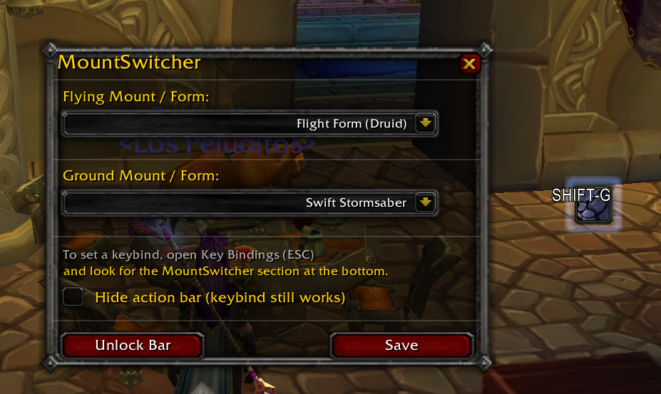
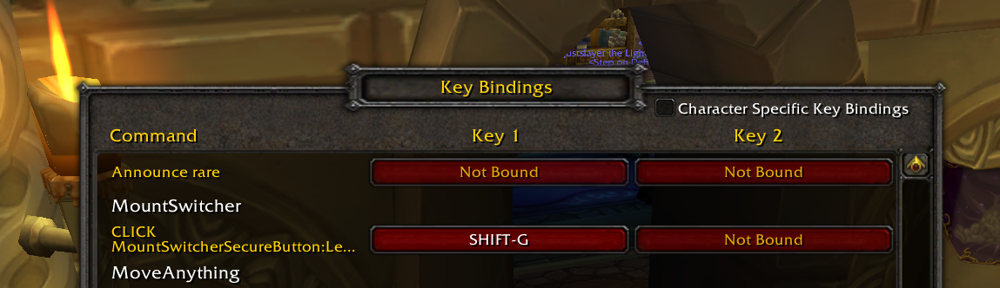

# MountSwitcher

A World of Warcraft addon for WOTLK 3.3.5 and Classic Era that automatically switches between your flying and ground mounts based on the zone you're in.

## Features

- **Automatic Mount Switching** — Automatically summons the appropriate mount when you enter a flying-capable zone or return to ground.
- **Two Mount Slots** — Configure your preferred flying mount and ground mount via the options panel.
- **Combat Safe** — Works reliably outside of combat and integrates with WoW's secure action button system.
- **Minimal UI** — Lightweight action bar that shows your current mount. Hide it if you only use keybinds.
- **Multiple Versions** — Separate versions for WOTLK (3.3.5) and Classic Era, each with their own mount databases.
- **Class Mounts** — Automatically detects and includes class-specific mounts (Paladin chargers, Warlock dreadsteeds, Druid forms, etc.).

## Screenshots

### Options Panel


### Key Bindings


## Installation

### From Release
1. Download the latest release from the [Releases](https://github.com/ravelaso/MountSwitcher/releases) page.
2. Extract the zip file.
3. Copy the `MountSwitcher` folder to your WoW addons directory:
   - **WOTLK**: `World of Warcraft _classic_/Interface/AddOns/`
   - **Classic**: `World of Warcraft classic/Interface/AddOns/`

### Manual / Development
```bash
git clone https://github.com/ravelaso/MountSwitcher.git
# Copy or symlink to your AddOns folder
```

## How to Use

### Commands

| Command | Description |
|---------|-------------|
| `/ms options` | Open the options panel to configure your mounts |
| `/ms mount` | Manually summon your current mount (out of combat) |
| `/ms reload` | Refresh the mount list (useful after learning new mounts) |
| `/ms lock` | Lock the action bar in place |
| `/ms unlock` | Unlock the action bar to reposition it |
| `/ms debug` | Toggle debug output (for troubleshooting) |
| `/ms` | Show available commands |

### Keybind Setup
1. Open WoW's keybindings menu (ESC → Key Bindings)
2. Scroll down to the **MountSwitcher** section
3. Bind "Summon Mount" to your preferred key

## For Developers

### Project Structure

```
MountSwitcher/
├── MountSwitcher.lua       # Main loader (stub)
├── MountSwitcher.toc       # WOTLK manifest
├── MountSwitcher_Classic.toc # Classic manifest
├── MountSwitcher.xml       # XML definitions (namespace)
├── Bindings.xml            # Key binding definitions
├── lib/
│   ├── MS_Core.lua         # Main initialization, event handling
│   ├── MS_Constants.lua    # Class spell definitions
│   ├── MS_Utils.lua        # Utility functions
│   ├── MS_MountDB_WOTLK.lua # Mount database for WOTLK
│   ├── MS_MountDB_Classic.lua # Mount database for Classic
│   ├── MS_UI.lua           # Bar frame and drag logic
│   ├── MS_SecureButton.lua # Secure button for mount summoning
│   ├── MS_Options.lua      # Options panel UI
│   ├── MS_ContextMenu.lua  # Right-click context menu
│   └── MS_Bindings.lua     # Slash commands
└── README.md
```

### Contributing

1. **Fork** the repository
2. Create a **feature branch**: `git checkout -b feature/my-feature`
3. Make your **changes**
4. **Test** in-game
5. Commit with **clear messages**: `git commit -m "feat: add new feature"`
6. **Push** and open a Pull Request

### Coding Standards

- Use **descriptive names** for functions and variables
- Add **comments** for non-obvious logic
- Follow the **module pattern**: each file is a module that extends the `MS` table
- Keep functions **focused** and small
- Test both **WOTLK** and **Classic** versions when modifying mount-related code

### Testing

1. Copy the `MountSwitcher` folder to your WoW `Interface/AddOns` directory
2. Reload UI (`/console reloadui` or `/script ReloadUI()`)
3. Check for Lua errors in the default chat frame
4. Test all slash commands: `/ms`, `/ms options`, `/ms mount`, `/ms reload`

### Building Releases

The project uses GitHub Actions for automated builds. On each tag push (`v*`), the workflow:
1. Builds both WOTLK and Classic zips
2. Preserves the `lib/` folder structure
3. Creates a GitHub Release with the artifacts

```bash
# Create a new release
git tag v1.5.1
git push origin v1.5.1
```

## License

MIT License — feel free to use, modify, and distribute.

## Support

For bugs, feature requests, or questions:
- Open an [issue](https://github.com/ravelaso/MountSwitcher/issues)
- Or reach out on the repo's discussions
